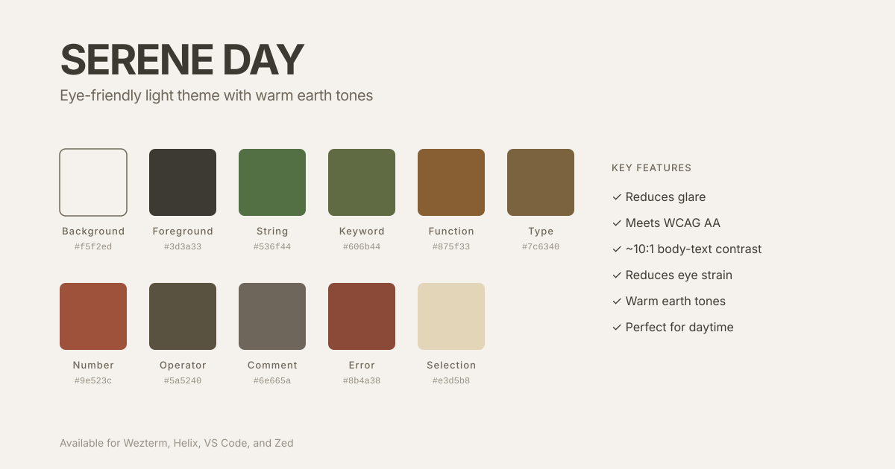
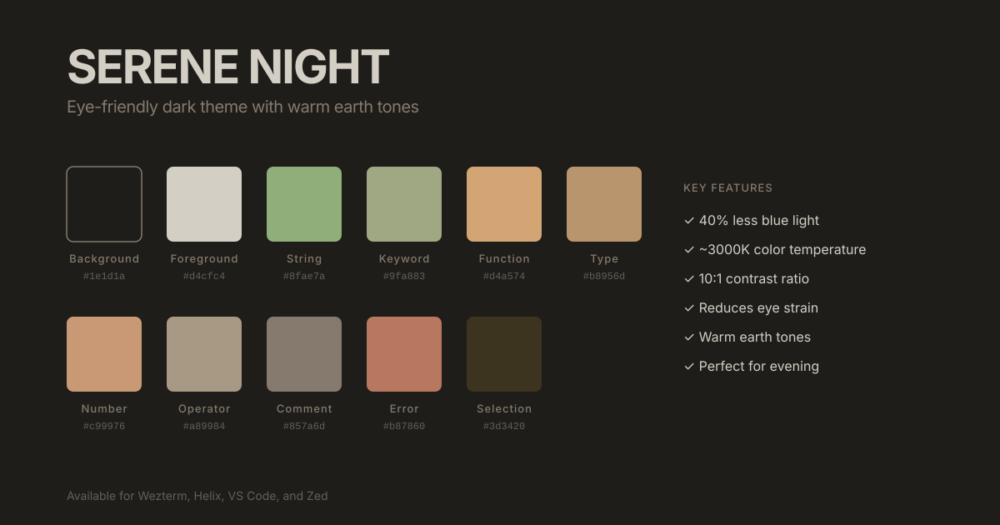
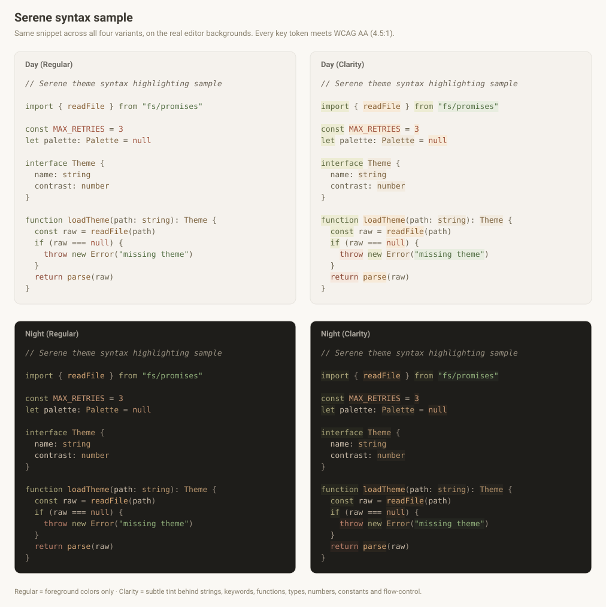

# Serene Theme

A warm, earth-toned color scheme for comfortable extended screen use. Serene shifts colors away from harsh blues toward softer oranges, greens, and yellows. The result is a theme that feels like reading on aged paper rather than staring at a bright screen. Available in light (Day) and dark (Night) variants.

## Eye Health

Serene avoids pure white and pure black, which cause your pupils to constantly adjust. Colors are muted to reduce glare during long sessions, and the warmer palette lowers blue-light exposure in the evening (though screen brightness matters more than color for sleep).

The palette draws on computer-vision-syndrome (CVS) research: a slightly warm palette with no high-chroma blue accents, muted saturation, and no pure white or black. Every syntax token meets **WCAG AA (4.5:1)** contrast against every background it sits on, including the active line and Clarity tints. Body text targets ~10:1, while syntax stays in a gentler 4.5–7:1 band so highlighting separates tokens without glare. Diagnostic accents like errors and warnings are tuned for salience and carry non-color cues, so they sit outside that floor.

## FAQ

### What's the difference between Classic and Clarity?

Both use the same colors. Clarity adds subtle background highlights to certain syntax elements for easier scanning. It's only available in Helix and VSCode since other editors don't support syntax backgrounds.

### Why aren't the colors more vibrant?

Muted colors reduce eye fatigue during extended use. The tradeoff is intentional.

### Is this suitable for colorblind users?

That depends. All text meets WCAG AA contrast, so readability doesn't depend on color. However, Serene separates several syntax roles (strings, keywords, functions, numbers) mainly by warm hue. This means under red-green color vision deficiency, the most common kind, those greens, olives, and browns can converge. 

## Development

All colors are defined in `palette.toml` and theme files are generated from templates.

### Changing a color

1. Edit the color value in `palette.toml`
2. Run `python3 build.py` (requires Python 3.11+)
3. All 22 theme files in `themes/` update automatically

### How it works

- `palette.toml` is the single source of truth. Named colors are organized into `[day]`, `[night]`, `[day-clarity]`, and `[night-clarity]` sections.
- `templates/` holds theme files with `{{section.color-name}}` placeholders (e.g., `{{day.forest}}`, `{{night.parchment|nohash}}`).
- `build.py` reads the palette, renders each template, and writes the result to `themes/`.

Available filters: `|nohash` (strip `#`), `|alpha:XX` (append alpha hex).

### Adding a new editor

1. Create a template in `templates/editor-name/` using palette references
2. Run `python3 build.py` to generate the theme file
3. Verify the output in `themes/editor-name/`

## License

MIT

---

**Remember**: The best theme is one that makes your eyes comfortable. If Serene doesn't work for you, that's okay!

---

## Preview

### Serene Day (Light)

### Serene Night (Dark)

### Syntax Sample

The same snippet across all four variants.

