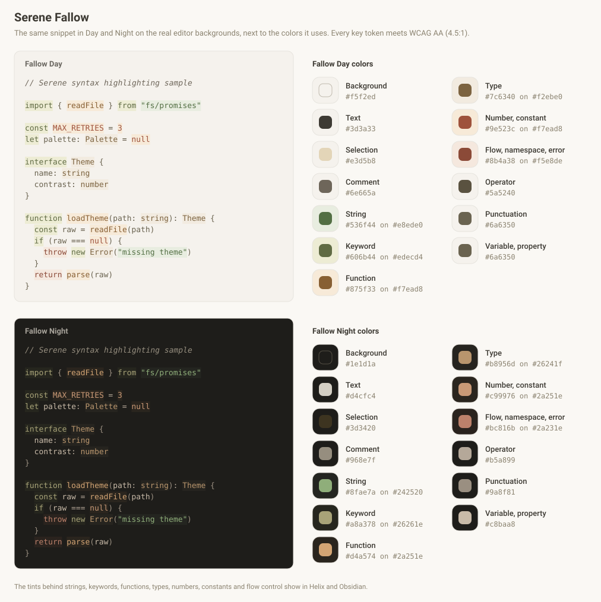
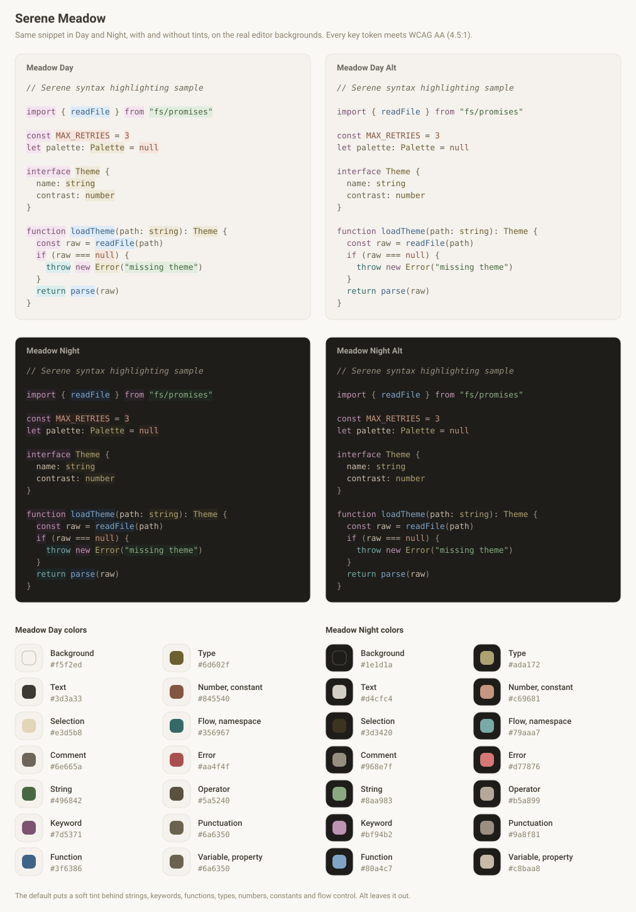

# Serene Theme

A color scheme that's easy on the eyes when you're coding all day. Serene keeps the contrast soft and the colors muted, so it feels more like reading on paper than staring at a bright screen.

It comes in two palettes. Fallow is the original and sticks to warm browns, olives and greens. Meadow uses muted colors from the whole color wheel, so red, green, yellow, blue, magenta and cyan in your terminal actually look like what they are. Both have a light version (Day) and a dark one (Night).

In editors that can do it, Serene puts a soft tint behind strings, keywords, functions and the like so they're easier to scan. If you'd rather not have the tints, pick the Alt version, for example Serene Fallow Day Alt.

## Screenshots

The same snippet in Day and Night, with the colors each one uses next to it.

## Eye Health

Serene avoids pure white and pure black, which cause your pupils to constantly adjust. Colors are muted to reduce glare during long sessions. Meadow isn't more saturated than Fallow. It just uses more hues at the same softness.

Fallow keeps blue out of the palette, which helps a little in the evening. Meadow brings some blue back. By a rough estimate, Meadow Night gives off about 15% more blue light across the whole screen than Fallow Night. During the day the difference is close to zero, because the light background drowns it out. Screen brightness matters far more than this, so turning the brightness down a notch makes up for it.

Serene keeps contrast fairly low, but not too low. Body text sits around 10:1. Syntax colors sit a bit lower so they don't shout at you, but every one of them stays above 4.5:1, the usual accessibility minimum (WCAG AA). That holds on the highlighted current line and behind the tints too. Errors and warnings are the exception, since they also get squiggles and icons.

## Supported Editors

VSCode, Helix, Zed, OpenCode, Obsidian, WezTerm, Ghostty, Alacritty, Kitty, Fish and FZF. The theme files are in [`themes/`](themes), and [COLOR_GUIDE.md](COLOR_GUIDE.md) has the full list of colors.

## FAQ

### Which palette should I pick?

Fallow is the gentler of the two and the one to pick if comfort comes first. Pick Meadow if you rely on tools that use color to tell things apart, like `ls`, `git diff` or compiler errors. In Fallow, blue, magenta and cyan are muted greens, browns and grays, so those tools lose some of their meaning.

### Why do only some editors have an Alt version?

The tints need an editor that can put a background color behind syntax. Right now that's VSCode, Helix and Obsidian. Terminals, Zed, OpenCode, Fish and FZF can't, so they only come in one version. The text colors are the same with or without tints.

### Why aren't the colors more vibrant?

Muted colors are easier on the eyes over long sessions. That's on purpose.

### Is this suitable for colorblind users?

That depends. Contrast is fine, so you can read everything without relying on color. Telling the colors apart is harder.

Fallow mostly tells strings, keywords, functions and numbers apart by warm hue. With red-green color blindness, the most common kind, those greens, olives and browns blend together. Meadow does better here, since keywords, functions and namespaces move to plum, blue and teal. Strings, types and numbers can still look alike, because all Meadow syntax colors have the same lightness.

With blue-yellow color blindness, which is rare, Meadow is a little worse than Fallow, since functions (blue) and namespaces (teal) look alike.

## Contributing

All colors live in `palette.toml`, and the theme files are generated from templates. See [CONTRIBUTING.md](CONTRIBUTING.md) for how it works.

## License

MIT
