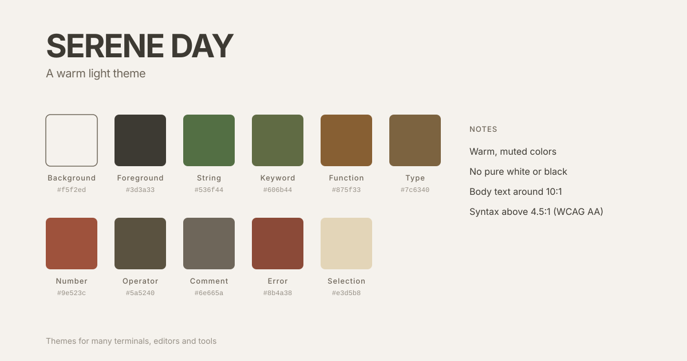
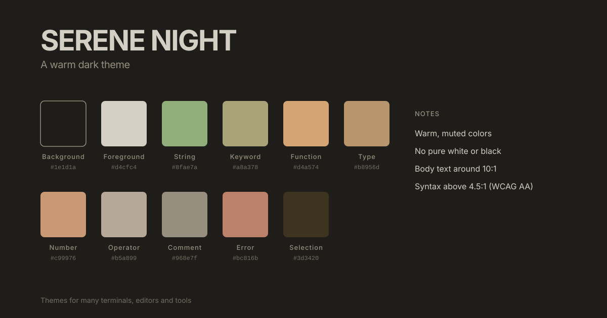
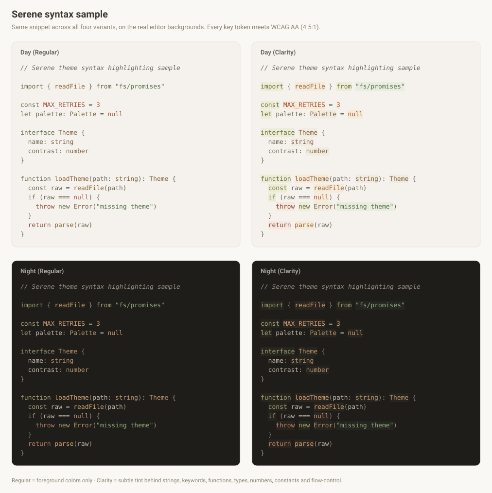

# Serene Theme

A warm, earth-toned color scheme that's easy on the eyes when you're coding all day. Serene moves away from harsh blues toward warm browns and greens, so it feels more like reading on paper than staring at a bright screen. There's a light version (Day) and a dark one (Night). Some editors also get a Clarity version, which adds a light background tint behind things like strings and keywords so they're easier to scan.

## Screenshots

The same snippet in Day and Night, each with and without Clarity:

## Eye Health

Serene avoids pure white and pure black, which cause your pupils to constantly adjust. Colors are muted to reduce glare during long sessions, and the warmer palette lowers blue-light exposure in the evening (though screen brightness matters more than color for sleep).

Serene keeps contrast fairly low, but not too low. Body text sits around 10:1. Syntax colors sit a bit lower so they don't shout at you, but every one of them stays above 4.5:1, the usual accessibility minimum (WCAG AA). That holds on the highlighted current line and behind the Clarity tints too. Errors and warnings are the exception, since they also get squiggles and icons.

## Supported Editors

VSCode, Helix, Zed, OpenCode, Obsidian, WezTerm, Ghostty, Alacritty, Kitty, Fish and FZF. The theme files are in [`themes/`](themes), and [COLOR_GUIDE.md](COLOR_GUIDE.md) has the full list of colors.

## FAQ

### Why do only some editors get Clarity?

Clarity needs an editor that can put a background color behind syntax. Right now that's VSCode, Helix and Obsidian. The text colors are the same in both versions.

### Why aren't the colors more vibrant?

Muted colors are easier on the eyes over long sessions. That's on purpose.

### Is this suitable for colorblind users?

That depends. Contrast is fine, so you can read everything without relying on color. But Serene mostly tells strings, keywords, functions and numbers apart by warm hue. With red-green color blindness, the most common kind, those greens, olives and browns can blend together.

## Contributing

All colors live in `palette.toml`, and the theme files are generated from templates. See [CONTRIBUTING.md](CONTRIBUTING.md) for how it works.

## License

MIT
